# DaxBench: Benchmarking Deformable Object Manipulation with Differentiable Physics [ICLR 2023 Oral]

[\[project\]](https://github.com/AdaCompNUS/DaXBench) [\[paper\]](https://arxiv.org/pdf/2210.13066.pdf) [\[website\]](https://daxbench.github.io/) [\[documentation\]](https://daxbench.readthedocs.io/en/latest/)

Deformable object manipulation (DOM) is a long-standing challenge in robotics and has attracted significant interest recently. This work presents DaXBench, a differentiable simulation framework for DOM. While existing work often focuses on a specific type of deformable objects, DaXBench supports fluid, rope, cloth . . . ; it provides a general-purpose benchmark to evaluate widely different DOM methods, including planning, imitation learning, and reinforcement learning. DaXBench combines recent advances in deformable object simulation with JAX, a high-performance computational framework. All DOM tasks in DaXBench are wrapped with the OpenAI Gym API for easy integration with DOM algorithms. We hope that DaXBench provides to the research community a comprehensive, standardized benchmark and a valuable tool to support the development and evaluation of new DOM methods. 

<table>
  <tr>
    <td align="center">
      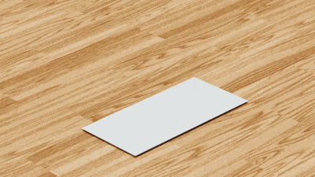<br>
      <figcaption>Folding cloth.</figcaption>
    </td>
    <td align="center">
      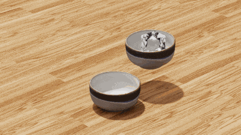<br>
      <figcaption>Pouring water.</figcaption>
    </td>
    <td align="center">
      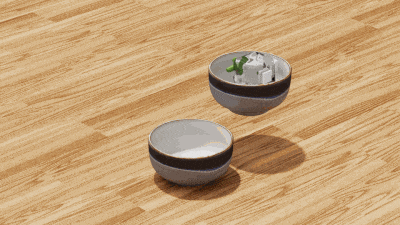<br>
      <figcaption>Pouring soup.</figcaption>
    </td>
  </tr>
</table>

## Deformable Objects supported by DaxBench

DaxBench supports a wide variety of common deformable objects, including liquid, fabric, elasto-plastic, and mixture with their differentiable physics engine respectively. Some of the deformable objects are illustrated below.

<table>
  <tr>
    <td align="center">
      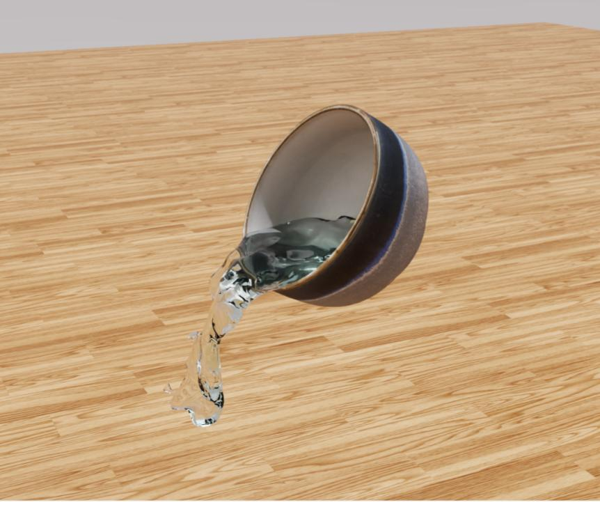<br>
      <figcaption>Liquid.</figcaption>
    </td>
    <td align="center">
      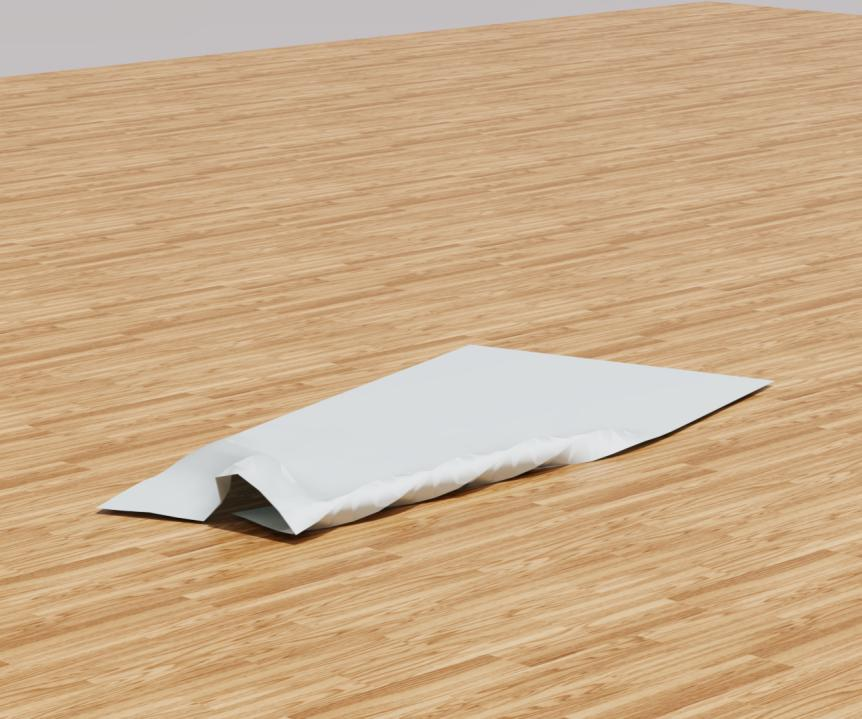<br>
      <figcaption>Fabric.</figcaption>
    </td>
    <td align="center">
      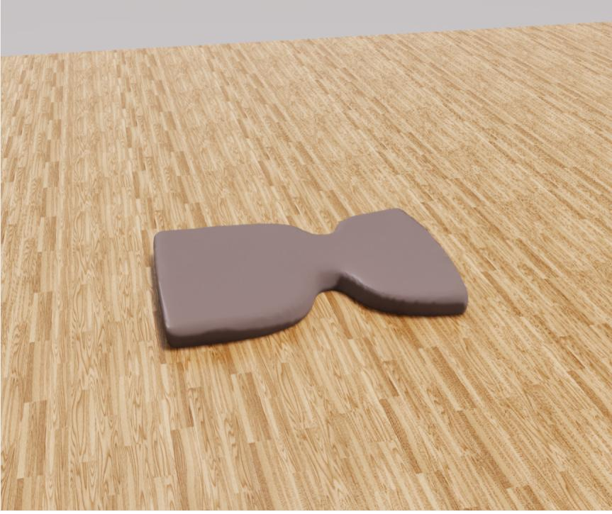<br>
      <figcaption>Elasto-plastic.</figcaption>
    </td>
    <td align="center">
      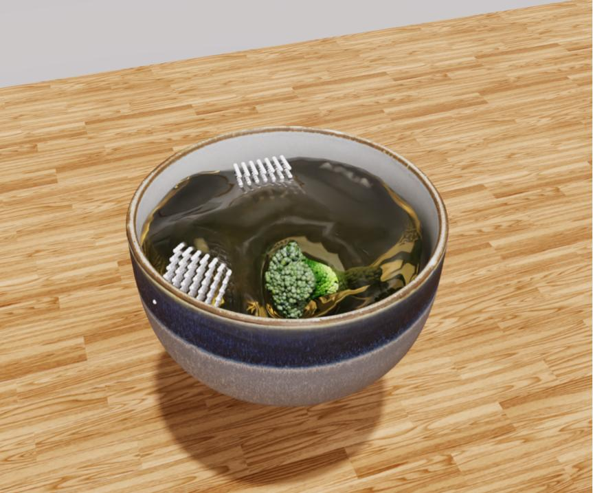<br>
      <figcaption>Mixture.</figcaption>
    </td>
  </tr>
</table>


## DOM Tasks supported by DaxBench

DaXBench provides a comprehensive set of Deformable Object Manipulation tasks, including liquid pouring, rope wiping, cloth folding, and sculpting elastoplastic objects. These tasks are representative of the common deformable objects encountered in daily life. We illustrate some tasks below.

<table>
  <tr>
  <td align="center">
      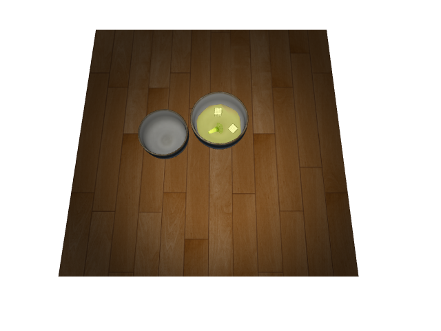<br>
      <figcaption>Pour Soup.</figcaption>
    </td>
    <td align="center">
      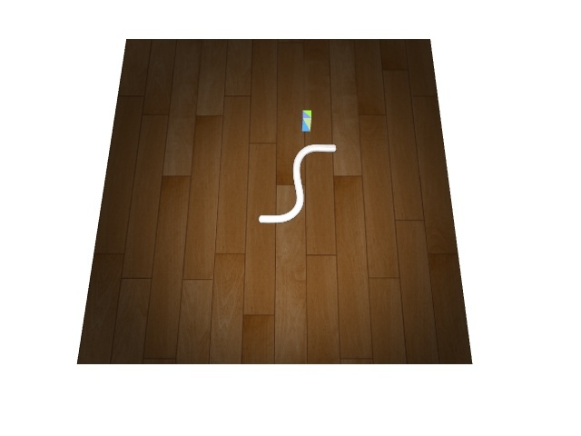<br>
      <figcaption>Push Rope.</figcaption>
    </td>
    <td align="center">
      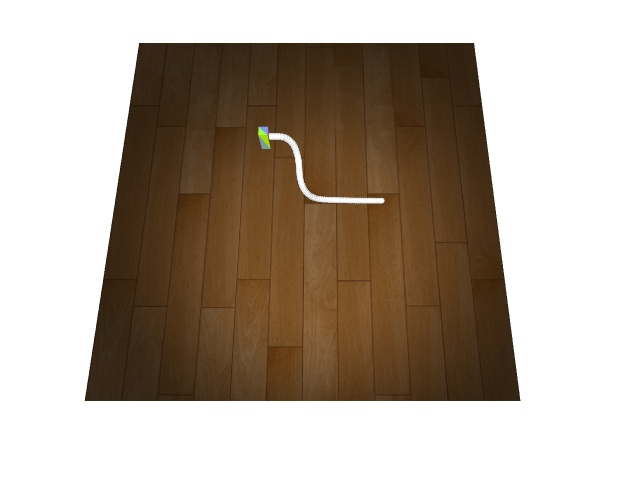<br>
      <figcaption>Whip Rope.</figcaption>
    </td>
    <td align="center">
      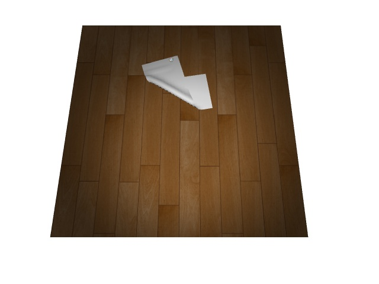<br>
      <figcaption>Fold cloth.</figcaption>
    </td>
    <td align="center">
      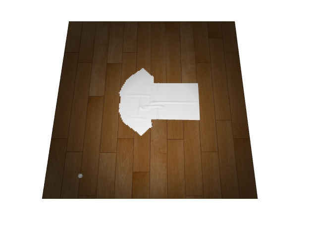<br>
      <figcaption>Fold T-shirt.</figcaption>
    </td>    
  </tr>
</table>

## DOM Methods supported by DaxBench

DaxBench benchmark eight representative methods of deformable object
manipulation, covering planning, imitation learning, and reinforcement learning. We first release the training code for APG. The rest of the algorithms will be released soon.

<table>
  <thead>
    <tr>
      <th colspan="3">Reinforcement learning</th>
      <th colspan="2">Imitation learning</th>
      <th colspan="3">Planning</th>
    </tr>
  </thead>
  <tbody>
    <tr>
      <td>APG</td>
      <td>SHAC</td>
      <td>PPO</td>
      <td>Transporter</td>
      <td>ILD</td>
      <td>CEM-MPC</td>
      <td>Diff-MPC</td>
      <td>Diff-CEM_MPC</td>
    </tr>
    <tr>
      <td> :heavy_check_mark: </td>
      <td> :heavy_check_mark: </td>
      <td> :heavy_check_mark: </td>
      <td>  </td>
      <td>  </td>
      <td>  </td>
      <td>  </td>
      <td>  </td>
    </tr>
  </tbody>
</table>

## Documentation

We offer comprehensive documentation for our benchmark, complete with an installation guide and sample code for testing and executing the algorithms. Our documentation is available [here](https://daxbench.readthedocs.io/en/latest/).

## Installation Guide

Easily install DaxBench by following the steps listed below! For a comprehensive installation guide, refer to our documentation [here](https://daxbench.readthedocs.io/en/latest/).


### Install Jax. 
Simply follow the [official instructions](https://github.com/google/jax#installation).


### Install Daxbench

    pip install git+https://github.com/fogleman/sdf.git
    pip install -e .


You'll be all set!

## Simple Example

The supported tasks share similar APIs to the OpenAI Gym’s standard environments. We provide
a general template to define tasks in our simulator. This not only better organizes the existing task
environments but also allows the users to customize the existing task environments to better suit their
research requirements. The variables and constants defined in the template are easily interpretable
quantities that correspond to real physical semantics. This allows the users to better understand the
environment, which can also help with the development and debugging process.

### Create Environment

We demonstrate how to create
multiple parallel ``daxbench`` environments, perform forward simulation, and
calculate gradients with respect to an objetive function below.

We first create 3 parallel ``shape_rope`` environments, and three actions
corresponding to the three envrionments.

```python
    import jax
    import jax.numpy as jnp
    from daxbench.core.envs import ShapeRopeEnv

    # Crreate the environments
    env = ShapeRopeEnv(batch_size=3, seed=1)
    obs, state = env.reset(env.simulator.key)

    # Actions to be simulated in each environment
    actions = jnp.array(
        [
            [0.4, 0, 0.4, 0.6, 0, 0.6],
            [0.6, 0, 0.6, 0.4, 0, 0.4],
            [0.4, 0, 0.6, 0.6, 0, 0.4],
        ]
    )
```
Then we apply the actions to the environments. We use the method
``step_with_render`` to visualize the effect of the first action in the first
environment; note that this method is not accelerated by ``Jax``.

```python
    obs, reward, done, info = env.step_with_render(actions, state)
    next_state = info["state"]
```

### Environment Step Function

To take advantage of Jax, we suggest to separate rendering from the forward
simulation. ``step_diff`` method is accelerated by Jax's just-in-time (jit)
compilation.

```python
    obs, reward, done, info = env.step_diff(actions, state)
    next_state = info["state"]
    image = env.render(next_state, visualize=True)
```
### Compute Gradients from Step Function
To compute the gradient of the actions to maximize the reward, we use [jax.grad](https://jax.readthedocs.io/en/latest/_autosummary/jax.grad.html) as a
decorator. Instead of returning the objective value, the decorated fuction
returns the gradient of the objective with respect to the specified (by default
the first one) arguments.

```python
    @jax.jit
    @jax.grad
    def compute_grad(actions, state):
        obs, reward, done, info = env.step_diff(actions, state)
        objective_to_be_minimized =  - reward.sum()
        return objective_to_be_minimized

    print("action gradients:", compute_grad(actions, state))
```

## To Do
- Release Code & Tutorial for realistic rendering.
- Release Code for more baseline methods.

## Updates

[05/2023] Initial code release for DaxBench.

## Acknowledgement

This codebase greatly benefits from incorporating code from various repositories, especially for the baseline implementation. We're grateful to the authors of these repositories for open-sourcing their work!

- [ravens](https://github.com/google-research/ravens)
- [brax](https://github.com/google/brax)
- [DiffRL](https://github.com/NVlabs/DiffRL)
- [ILD](https://github.com/sail-sg/ILD)
- [constrained-cem-mpc](https://github.com/oscarkey/constrained-cem-mpc)
- [TaiChi](https://github.com/taichi-dev/taichi)
- [PlasticineLab](https://github.com/hzaskywalker/PlasticineLab)
